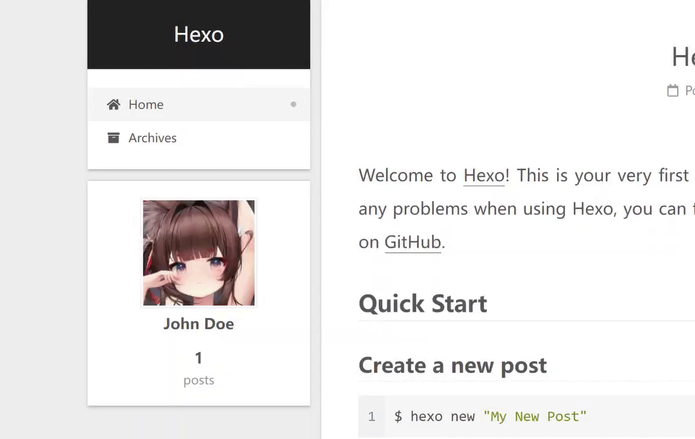

<!-- ATTENTION!
1. Please write pull request readme in English, thanks!

2. Always remember that NexT includes 4 schemes. And if on one of them works fine after the changes, on another scheme this changes can be broken. Muse and Mist have similar structure, but Pisces is very difference from them. Gemini is a mirror of Pisces with some styles and layouts remakes. So, please make the tests at least on two schemes (Muse or Mist and Pisces or Gemini).

3. In addition, you need to confirm that the changes made by this PR are compatible with PJAX and Dark Mode.
-->

## PR Checklist <!-- 我确认我已经查看了 -->
<!-- Change [ ] to [x] to select (将 [ ] 换成 [x] 来选择) -->

- [ ] The commit message follows [guidelines for NexT](https://github.com/theme-next/hexo-theme-next/blob/master/.github/CONTRIBUTING.md).
- [x] Tests for the changes was maked (for bug fixes / features).
   - [x] Muse | Mist have been tested.
   - [x] Pisces | Gemini have been tested.
- [ ] [Docs](https://github.com/theme-next/theme-next.org/tree/source/source/docs) in [NexT website](https://theme-next.org/docs/) have been added / updated (for features).
<!-- For adding Docs edit needed file here: https://github.com/theme-next/theme-next.org/tree/source/source/docs and create PR with this changes here: https://github.com/theme-next/theme-next.org/pulls -->

## PR Type
<!-- What kind of change does this PR introduce? -->

- [ ] Bugfix.
- [x] Feature.
- [ ] Code style update (formatting, local variables).
- [ ] Refactoring (no functional changes, no api changes).
- [ ] Build & CI related changes.
- [ ] Documentation.
- [ ] Translation. <!-- We use Crowdin to manage translations https://i18n.theme-next.org -->
- [ ] Other... Please describe:

## What is the current behavior?
<!-- Please describe the current behavior that you are modifying, or link to a relevant issue -->
The avatar can be changed when mouse on it.

And also, the original avatar and the other avatar can both be defined in `themes/next/_config.yml`。

Issue resolved: N/A

## What is the new behavior?
<!-- Description about this pull, in several words -->

- Screenshots with this changes:

it looks like this:



- Link to demo site with this changes: [Click to jump](http://hexo.sakebow.cn)

### How to use?

In NexT `_config.yml`:

```yml
# Sidebar Avatar
avatar:
  url: your_avatar_image
  # set another image so that your avatar will be changed when mouse over it
  # if configured as the same as `url`, it will look like nothing happened.
  url_changed: another_avatar_image
```

However, it's worthy mentioned that:

+ `url_changed` can **only** take effect when `url` has been already configured
+ if `url_changed` is not configured, your avatar will remain as it is